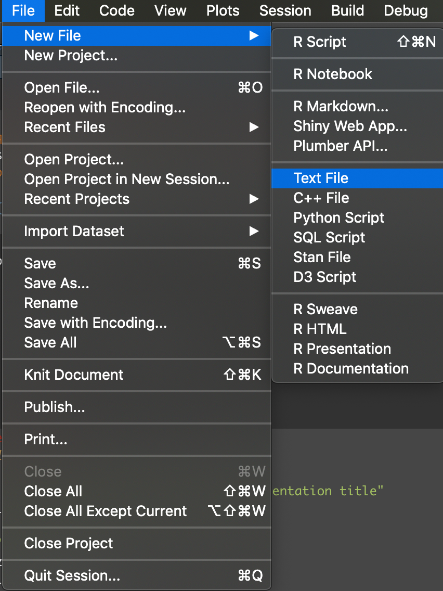

```{r setup, include=FALSE}
knitr::opts_chunk$set(cache = FALSE)
```

```{r,eval=TRUE,echo=FALSE}
def.chunk.hook <- knitr::knit_hooks$get("chunk")
knitr::knit_hooks$set(chunk = function(x, options) {
  x <- def.chunk.hook(x, options)
  ifelse(options$size != "normalsize", paste0("\\", options$size, "\n\n",x,"\n\n \\normalsize"),x)
})
```


# Benefits

- Fast slide deck creation.  

- Reproducible work.  
  
- Reuseable.


# Setup and installation

## Packages:  
- rmarkdown  
- tinytex  
    + PDF output; anything missing in LaTeX.
- pandoc  
    + command line installation 

```{r, rmarkdown, results='hide', eval=FALSE}
if(!require(pacman)){
    install.packages('pacman')
    library(pacman)
}
p_load(rmarkdown, tinytex)
```


# Types of presentation outputs

- ioslides  
- slidy  
- powerpoint  
- .Rpres  

>- beamer


# Creating a slide deck with beamer output

\btwocol  
{width=50%}

{width=50%}

\etwocol  

# Default Rmarkdown text


# YAML metadata  

## Format setup  
\btwocol  
{width=50%}

- Title slide  
- Desired output format  
- Formatting suboptions  

\etwocol  

# slide_level suboption for beamer presentations

## Example: slide_level: 2

\btwocol  
{width=50%}

{height=80%}
\etwocol  

# slide_level: 1
\btwocol
{width=64%}


\etwocol  

# Suboptions specific for the specified output format  

- `?rmarkdown::beamer_presentation`  

## Documentation  

{width=95%}


# Using LaTeX packages

## preamble.tex

\btwocol
{width=50%}


\etwocol  

# Invoking the LaTeX packages in the .Rmd file  

{width=80%}


# Markdown syntax - Reference Guide

\btwocol  
{width=60%}

{width=70%}
\etwocol  

# Embedding code chunks  

````
`r ''````{r optionalname}
# code here
```
````

\btwocol
{width=40%}

{width=60%}
\etwocol

```{r eval=TRUE, testdata, echo=TRUE, size="scriptsize"}
set.seed(7)
testnumbers <- rnorm(100,mean=0,sd=1)
summary(testnumbers)
```

# Embedding code chunks  

{width=70%}

```{r, testdata_changecomments, echo=TRUE,eval=TRUE,comment=''}
set.seed(7)
testnumbers <- rnorm(100,mean=0,sd=1)
summary(testnumbers)
```


# Inline code  

`` `r
function()` `` 


```{r, embedinlinecode, echo=TRUE,eval=TRUE,comment=''}
set.seed(7)
testnumbers <- rnorm(100,mean=0,sd=1)
```

{width=80%}

**Mean of testnumbers:** `r mean(testnumbers)`  

**Standard deviation of testnumbers:** `r sd(testnumbers)`


# Producing plots  


```{r,plots,comment='',eval=TRUE,echo=TRUE,size="scriptsize",fig.dim=c(3,2.3),fig.align="center"}
library(ggplot2)
boolean <- factor(rep(c('TRUE','FALSE'),each=200))
num <- c(rnorm(200), rnorm(200,mean=5))
dat <- data.frame(boolean, num)
ggplot(dat,
       aes(x = boolean, y = num, fill= boolean))+geom_boxplot()+guides(fill=FALSE)
```

# Render the markdown file

\btwocol  

- `render("filename.Rmd", "beamer_presentation")`  
- Mac: `Cmd + Shift + K`  
- Windows: `Ctrl + Shift + K`  

{width=40%}  

\etwocol


# Caching & Global Chunk Options  

## Individual code chunks:  

````
`r ''````{r, codechunkname, cache=TRUE, eval=FALSE}
# default: cache = FALSE
# computation
```
````

## Global control of code chunks:  

````
`r ''````{r, global}
knitr::opts_chunk$set(cache = TRUE)
```
````

# Conclusion  

## Slide deck creation using Rmarkdown  
- Install tinytex, rmarkdown, pandoc  
- Output format (ie - beamer)  
- YAML metadata  
- Content:  
  + Embedded code  
  + Plots  
  + Other information  
- Render  
- Caching  


# References and help

## General Markdown Help
https://www.rstudio.com/resources/cheatsheets/
https://bookdown.org/yihui/rmarkdown/

## Specific Output Format Help
`?rmarkdown::beamer_presentation`  
https://rmarkdown.rstudio.com/articles_beamer.html

# Acknowledgements

\btwocol
- **Wheelan lab**  
    + Sarah Wheelan  
    + Heather Wick  
    + Alyza Skaist  
    + Anuj Gupta  
    
- **Marchionni lab**  


{width=45%}   
\etwocol

